# NEKTE Protocol Flows

Visual diagrams of the core protocol interactions.

## 1. Progressive Discovery (L0 -> L1 -> L2)

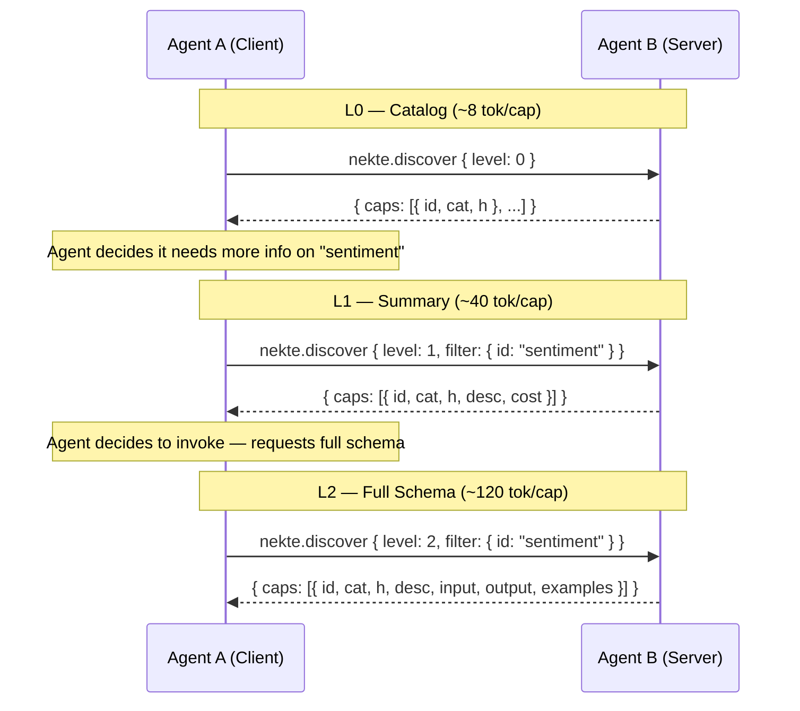

## 2. Zero-Schema Invocation

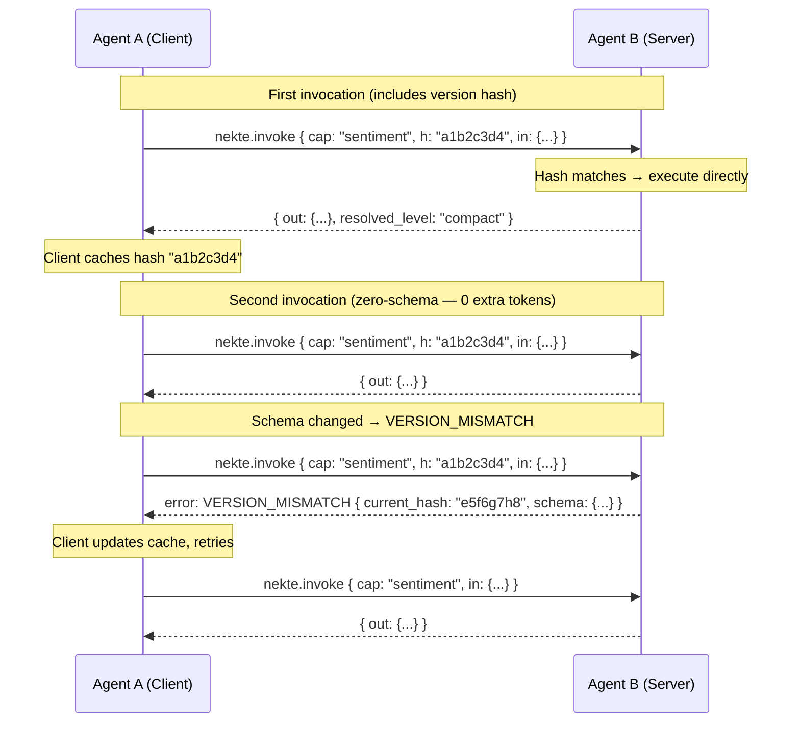

## 3. Task Delegation with Streaming (SSE)

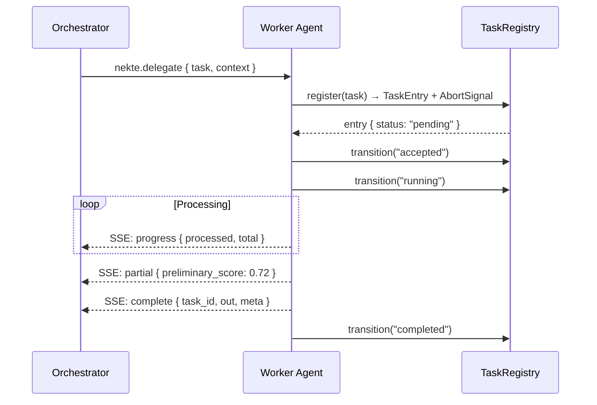

## 4. Task Cancellation

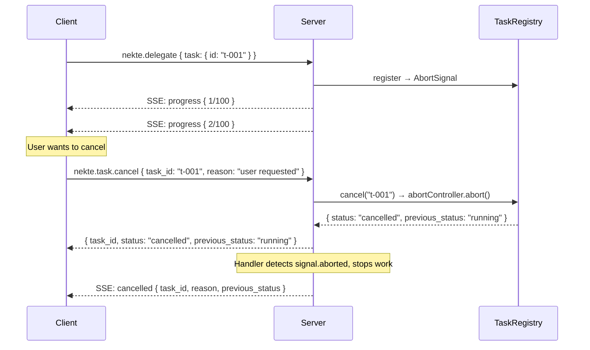

## 5. Task Suspend + Resume

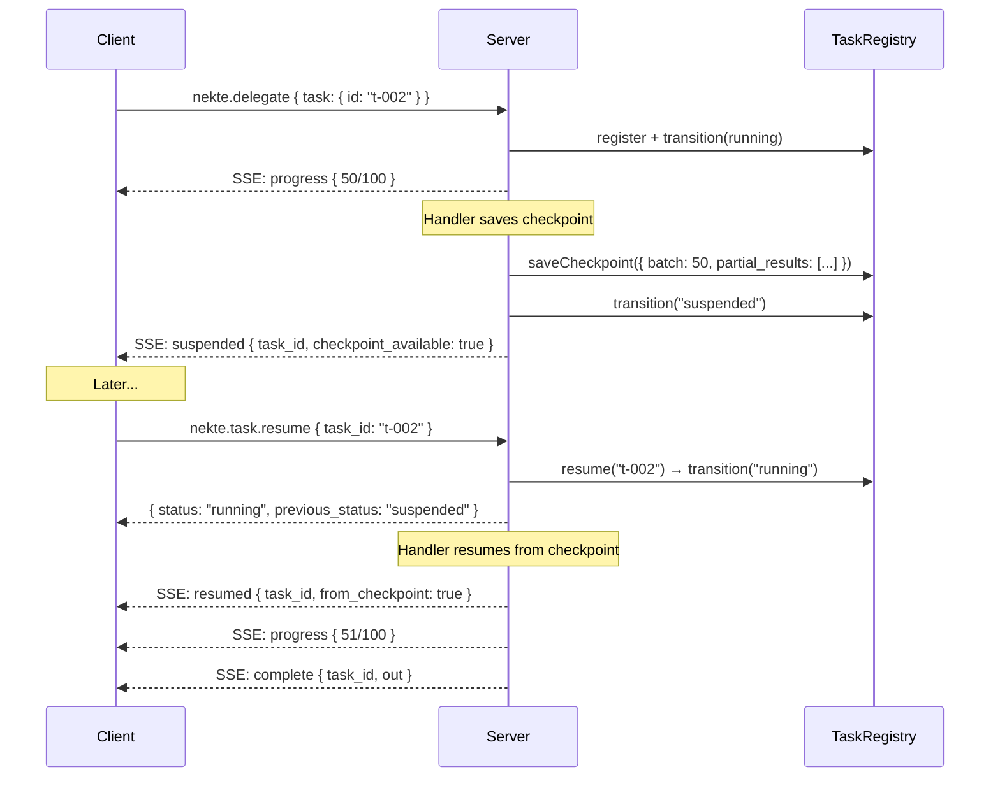

## 6. Task Lifecycle State Machine

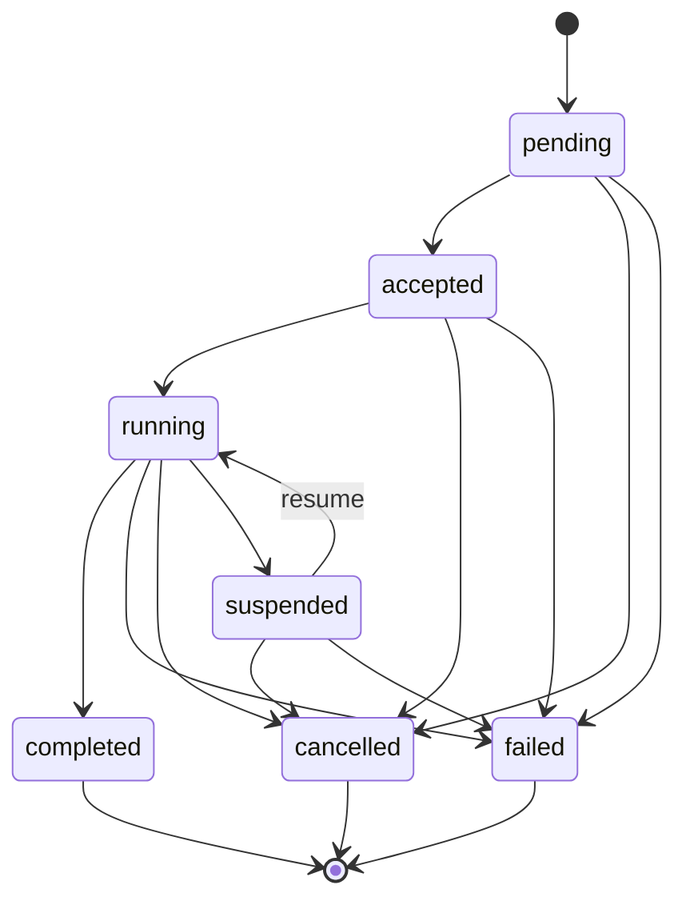

## 7. gRPC Transport Flow

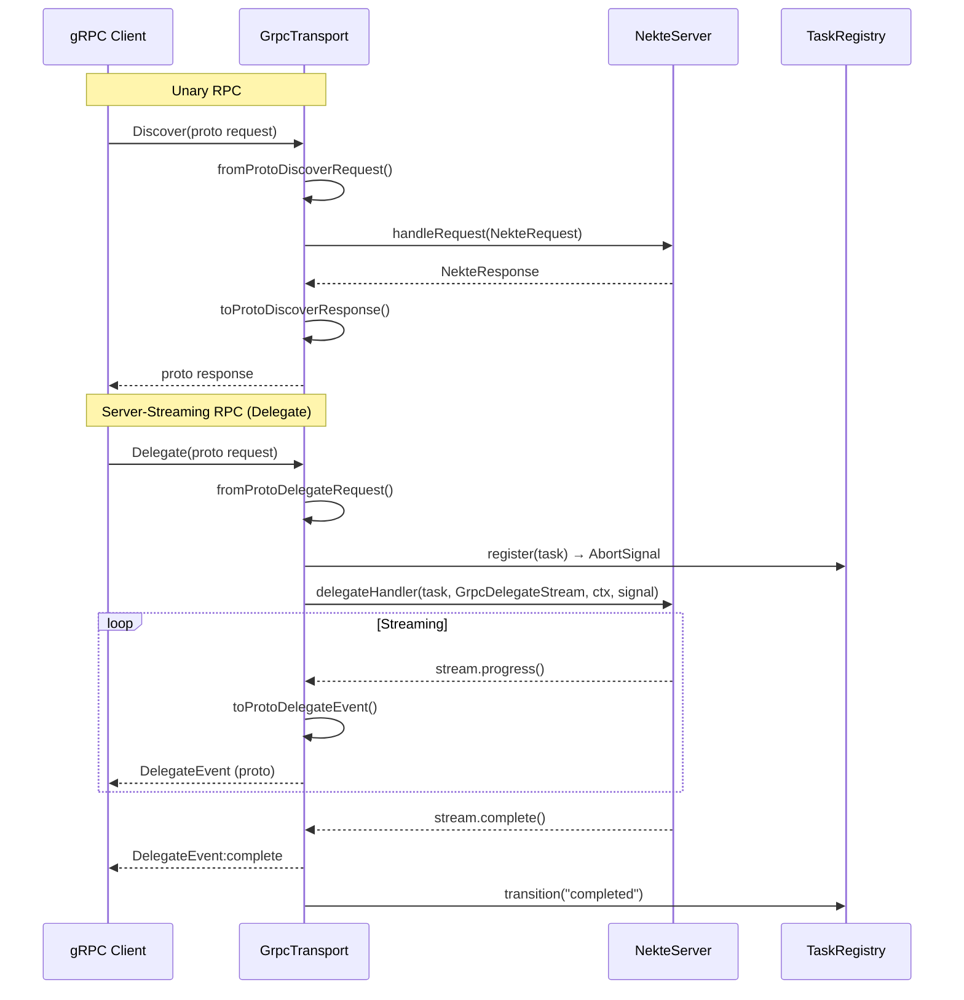

## 8. MCP Bridge Flow

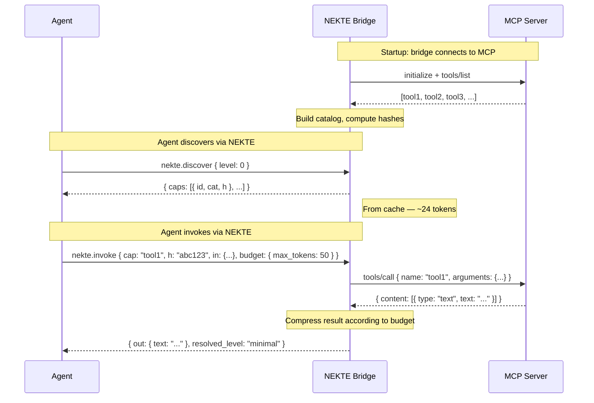

## 9. Token Budget Resolution

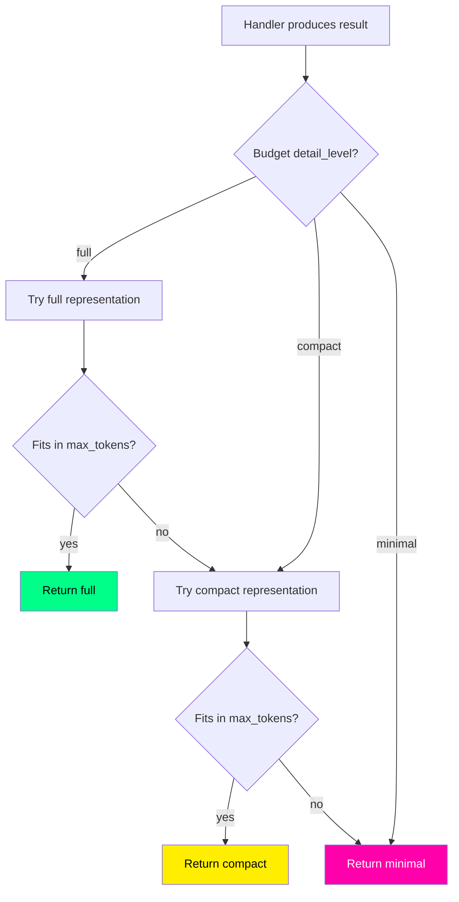

## 10. Transport Architecture (Hexagonal)

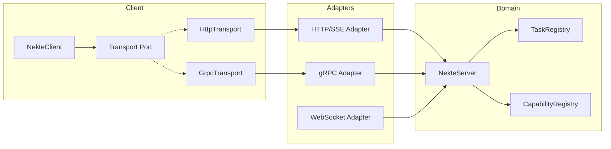

## 11. Wire Format Options

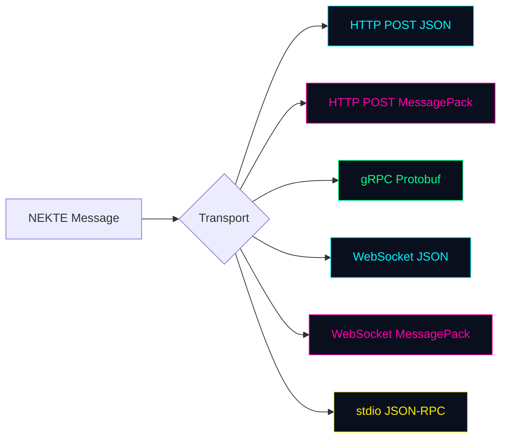
